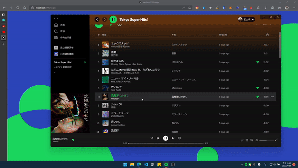

<a href="https://airbnb-clone-gamma-livid.vercel.app/" target="_blank"></a>

A Spotify clone project built with `TypeScript`, `React/Redux`, `Nextjs`, `TailwindCSS`, etc. Users can log into Spotify with `NextAuth` and get Spotify's permissions and control API through `spotify-web-api-node`.  The general users can see their song list on this site, and Premium level users can control the playback of their songs and volume directly on this site.

* [Installation](#installation)
* [Login Spotify (NextAuth.js and Spotify-Web-Api-Node)](#login-spotify-nextauthjs-and-spotify-web-api-node)
  * [0 - Dependencies](#0---dependencies)
  * [1 - Setup Spotify-Web-Api-Node](#1---setup-spotify-web-api-node)
  * [2 - Setup NextAuth](#2---setup-nextauth)
    * [2-1 API Route](#2-1-api-route)
    * [2-2 callbacks jwt](#2-2-callbacks-jwt)
    * [2-3 callbacks session](#2-3-callbacks-session)
  * [3 - Setup Custom Front-End Login Page](#3---setup-custom-front-end-login-page)
  * [4 - Setup Session Provider](#4---setup-session-provider)
  * [5 - Use `useSession()` to get token data](#5---use-usesession-to-get-token-data)
  * [6 - Setup Nextjs Middleware](#6---setup-nextjs-middleware)
  * [7 - Use `getSession` before client-side rendering](#7---use-getsession-before-client-side-rendering)
* [Components](#components)
* [State Management](#state-management)
  * [Redux](#redux)
  * [useContext](#usecontext)
* [Acknowledgement](#acknowledgement)

## Installation

- install Next.js with Typescript

```
npx create-next-app@latest --ts spotify-clone
// or 
npx create-next-app@latest -e with-typescript spotify-clone
```

- install `tailwindcss`

```
https://tailwindcss.com/docs/guides/nextjs
```

- install `@reduxjs/toolkit` and `react-redux`

```
npm install @reduxjs/toolkit react-redux
```

## Login Spotify (NextAuth.js and Spotify-Web-Api-Node)

We use `NextAuth` to login to Spotify and `Spotify-Web-Api-Node` to get the user information.

### 0 - Dependencies

- [nvm node.js 16.13.1](https://github.com/nvm-sh/nvm)
- [Spotify for Developers](https://developer.spotify.com/)
- [nextauth](https://next-auth.js.org/getting-started/example) (```npm i next-auth```)
- [spotify-web-api-node](https://github.com/thelinmichael/spotify-web-api-node) (```npm i spotify-web-api-node```)

### 1 - Setup Spotify-Web-Api-Node

- `Spotify-Web-Api-Node` helps us to login Spotify and re-login with `refreshtoken`
- `LOGIN_URL` is the login page the user will be redirected to
- `spotifyApi` can refresh user's `accesstoken`, get user's contents
- [Source code](lib/spotify.ts)

``` js
// lib/spotify.ts

import SpotifyWebApi from "spotify-web-api-node";

export const LOGIN_URL = `https://accounts.spotify.com/authorize?${new URLSearchParams(
    params
).toString()}`;

const spotifyApi = new SpotifyWebApi({
    clientId: process.env.SPOTIFY_CLIENT_ID,
    clientSecret: process.env.SPOTIFY_CLIENT_SECRET,
});

export default spotifyApi;
```

### 2 - Setup NextAuth

- `NextAuth` contains dynamic route handler and all other global configurations, such as JWT secret key, custom pages, custom callbacks
- [Source code](pages/api/auth/[...nextauth].ts)

#### 2-1 API Route

- `providers` lets you place authentication platforms such as Github, Spotify, etc.

``` js
export default NextAuth({
    providers: [
        SpotifyProvider({
            clientId: process.env.SPOTIFY_CLIENT_ID!,
            clientSecret: process.env.SPOTIFY_CLIENT_SECRET!,
            authorization: LOGIN_URL,
        }),
        // you can add more providers here...
    ],
})
```

#### 2-2 callbacks jwt

- `async jwt` is a callback function that is invoked when JWT token is created or updated, the return token will be stored in a cookie
- To make JWT token available in the browser, we need to pass the data in [session callback (#2-3 callbacks session)](#2-3-callbacks-session)
- [Documentation](https://next-auth.js.org/configuration/callbacks#jwt-callback)

> In our example:
>  1. When user initial login, a token with addtional info such as User ID, OAuth Access Token is returned
>  2. When user accesses with an unexpired token, the token itself is returned
>  3. When user's token is expired, we use `spotifyApi` to refresh user's token

``` js
callbacks: {
    async jwt({ token, account, user }) {
        // initial sign in
        if (account && user) {
            return {
                ...token,
                accessToken: account.access_token,
                refreshToken: account.refresh_token,
                userId: account.providerAccountId,
                accessTokenExpires: account.expires_at! * 1000,
            };
        }

        // accessToken still valid
        if (Date.now() < (token as SpotifyJWT).accessTokenExpires * 1000) {
            return token;
        }

        // accessToken expired, refresh it
        return await refreshAccessToken(token as SpotifyJWT);
    },
},
```

#### 2-3 callbacks session

- When using JWT for sessions, the JWT payload is provided here for further delivery to the client
- [Documentation](https://next-auth.js.org/configuration/callbacks#session-callback)

``` js
callbacks: {
    ...,
    async session({ session, token }) {
        session.accessToken = (token as SpotifyJWT).accessToken;
        session.refreshToken = (token as SpotifyJWT).refreshToken;
        session.userId = (token as SpotifyJWT).userId;

        return session;
    },
}
```

### 3 - Setup Custom Front-End Login Page

- `useProvider` in `getServerSideProps` gets the `providers` (e.g. Spotify) defined in `NextAuth` and pass them to the client
- `LoginPage` renders login button for each `providers` (in our case, we only have one provider - Spotify)
- You need to set `Redirect URIs` to `http://localhost:3000/api/auth/callback/spotify` in **Spotify for Developer**
- [Documentation for `signIn()`](https://next-auth.js.org/getting-started/client#signin)
- [Source Code](pages/login/index.tsx)

``` js
const LoginPage = ({ providers }: Props) => {
    ...
    {Object.values(providers).map((provider) => (
        <div key={provider.name}>
            <button
                onClick={() =>
                    signIn(provider.id, { callbackUrl: "/" })
                }>
                Login with {provider.name}
            </button>
        </div>
    ))}
    ...
};

export async function getServerSideProps() {
    const providers = await getProviders();
    return {
        props: {
            providers,
        },
    };
}
```

### 4 - Setup Session Provider

- Before we can access token in client side with `useSession()`, or in server side with `getSession()`, we have to setup `SessionProvider` in the `_app` 
- [Documentation](https://next-auth.js.org/getting-started/client#sessionprovider)

``` js
import { SessionProvider } from "next-auth/react";

function MyApp({ Component, pageProps: { session, ...pageProps } }: AppProps) {
    return (
        <SessionProvider session={session}>
            <Component {...pageProps} />
        </SessionProvider>
    );
}
```

### 5 - Use `useSession()` to get token data

- Now we can use `useSession()` to access the token in the react client
- [Documentation](https://next-auth.js.org/getting-started/client#usesession)

``` js
import { useSession } from "next-auth/react";

const Home = () => {
    const { data: session, status } = useSession();
    ...
}
```

### 6 - Setup Nextjs Middleware

- We can use middleware to redirect users who are not logged in to the login page
- [NextAuth getToken Documentation](https://next-auth.js.org/tutorials/securing-pages-and-api-routes#using-gettoken)
- [Nextjs Middleware Documentation](https://nextjs.org/docs/advanced-features/middleware)
- [Source Code](pages/_middleware.ts)

``` js
export async function middleware(req: any) {
    const secret = process.env.JWT_SECRET!;
    const token = await getToken({ req, secret });
    const { pathname, origin } = req.nextUrl;

    if (token || pathname.includes("/api/auth") || pathname === "/login") {
        return NextResponse.next();
    }

    if (!token) {
        return NextResponse.redirect(origin + "/login");
    }
}
```

### 7 - Use `getSession` before client-side rendering

- Use `getSession()` in SSR can pre-fetch authorization from Spotify
- [Source Code](pages/index.tsx)

``` js
export const getServerSideProps: GetServerSideProps = async (context) => {
    const session = await getSession(context);
    return {
        props: { session },
    };
};
```

## Components

- [Login Page](pages/login/index.tsx)
- [Sidebar](components/sidebar.tsx)
- [Profile and Logout Menu](components/profile.tsx)
- [Center (PlayList)](components/center.tsx)
  - [Songs](components/songs.tsx)
  - [Song](components/song.tsx)
- [Player](components/player.tsx)
- [Modal](components/modal.tsx)

## State Management

### Redux 

- [redux store](store/index.ts)
  - playlist
    - [slice/extrareducer](store/playlist-slice.ts)
    - [async actions (thunk)](store/playlist-action.ts)
  - track
    - [slice/reducer](store/track-slice.ts)

### useContext

- [modal-context](store/modal-context.tsx)

## Acknowledgement

- [Sonny Sangha](https://www.youtube.com/channel/UCqeTj_QAnNlmt7FwzNwHZnA)